# BookArchivist

BookArchivist is a World of Warcraft addon that automatically records every “book” you read in-game (anything shown in the default ItemText frame) and lets you revisit it later in a clean, Blizzard-style library UI.

- Never lose quest texts, letters, books, or scrolls again.
- Browse all saved texts in a searchable list.
- Read them in a rich reader that preserves formatting and embedded images where possible.

## Features

- **Automatic capture**
  - Listens to the standard ItemText events and saves each page you read into a per-character SavedVariables table (`BookArchivistDB`).
  - Handles multi-page books and updates existing entries when you see them again.

- **Two-pane UI**
  - Left pane: searchable, filterable list of saved books (and a locations view).
  - Right pane: reader with metadata (creator, material, last viewed, location) and page navigation.

- **Rich HTML reader**
  - Detects when captured content is HTML and uses a custom rich renderer instead of plain text.
  - Preserves headings, paragraphs, line breaks, and embedded images.
  - Includes a local atlas for Legion artifact “book” textures so those pages render correctly without depending on other addons.
  - Falls back to Blizzard’s SimpleHTML widget or plain text when needed.

- **Search and filters**
  - Search across titles and text from the main header search box.
  - Filter and sort modes exposed via the list header and dropdowns.

- **Export and Import**
  - Export single books or entire collections to share with other characters or players.
  - Import works automatically: paste an export string and the import starts when valid data is detected.
  - Supports cross-character and cross-client transfers.

- **Quality-of-life**
  - Minimap button and slash command entry points for opening the library.
  - Optional delete button in the reader with confirmation dialog.
  - Favorites system to bookmark important books.
  - "Resume last book" feature to return to your most recent read.

## Screenshots

### Main Interface
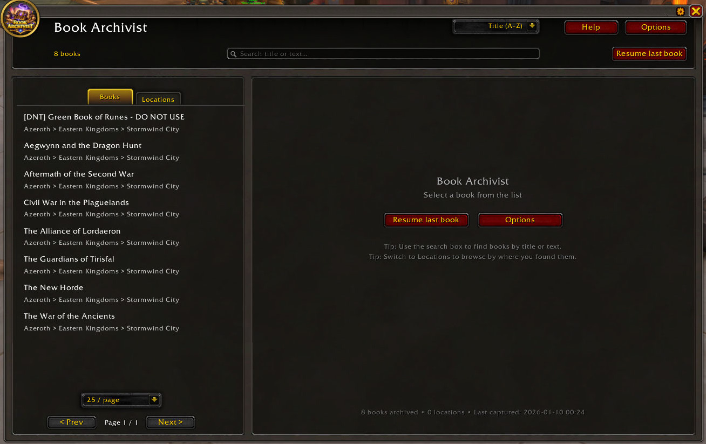

The main two-pane interface showing the searchable book list on the left and the rich text reader on the right.

### Book Reader
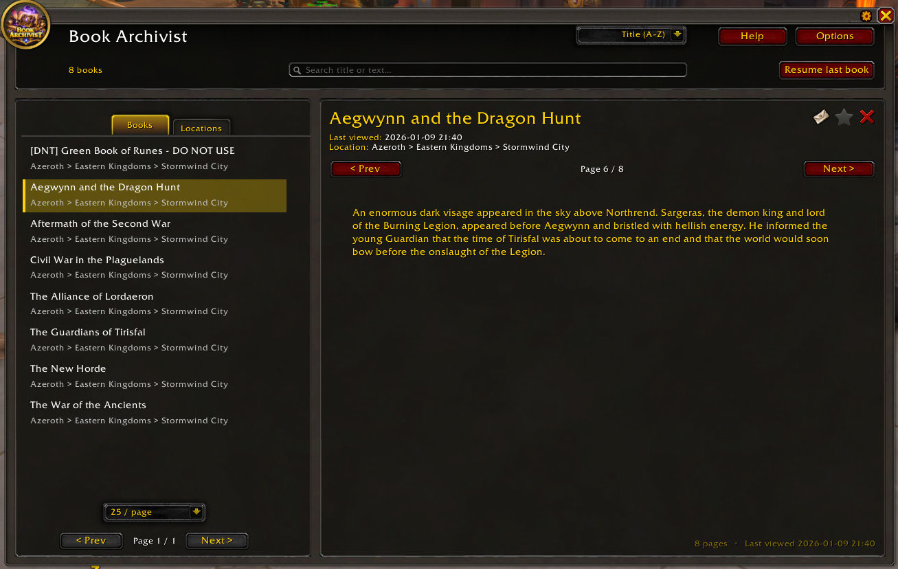

The reader displays book content with proper formatting, images, and page navigation.

### Favorites
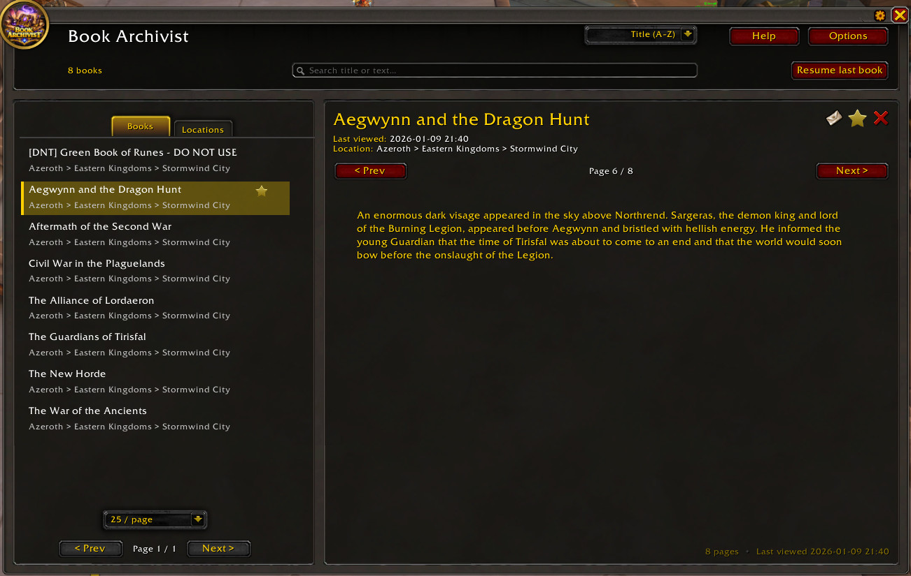

Mark important books as favorites for quick access.

### Location View
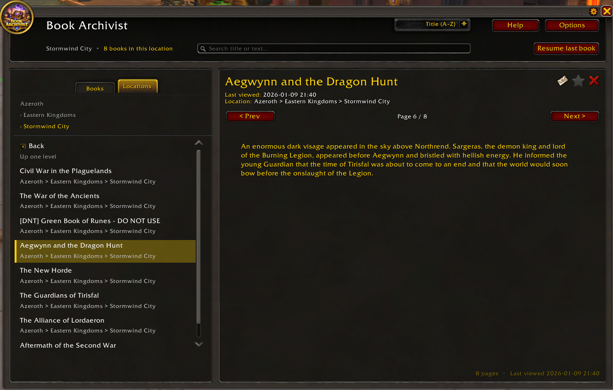

Browse books organized by where you found them in the world.

### Share & Export
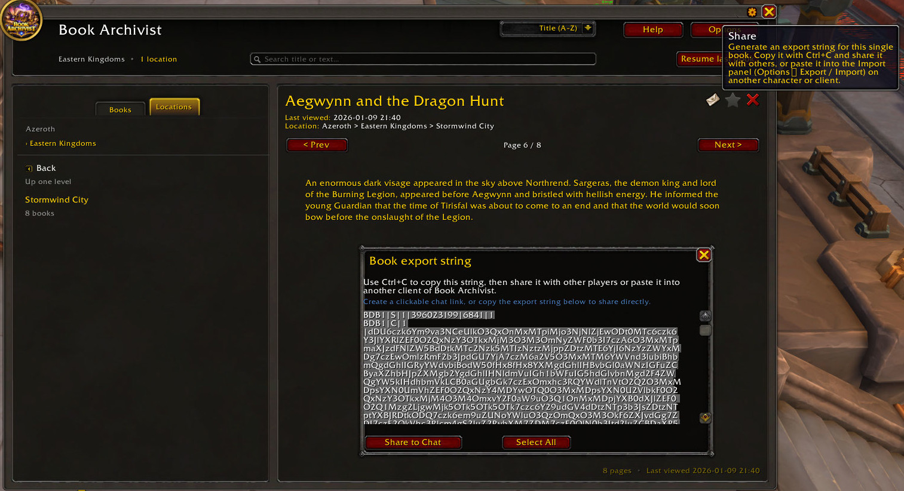


Export individual books or your entire library to share with others or backup your collection.

### Import System
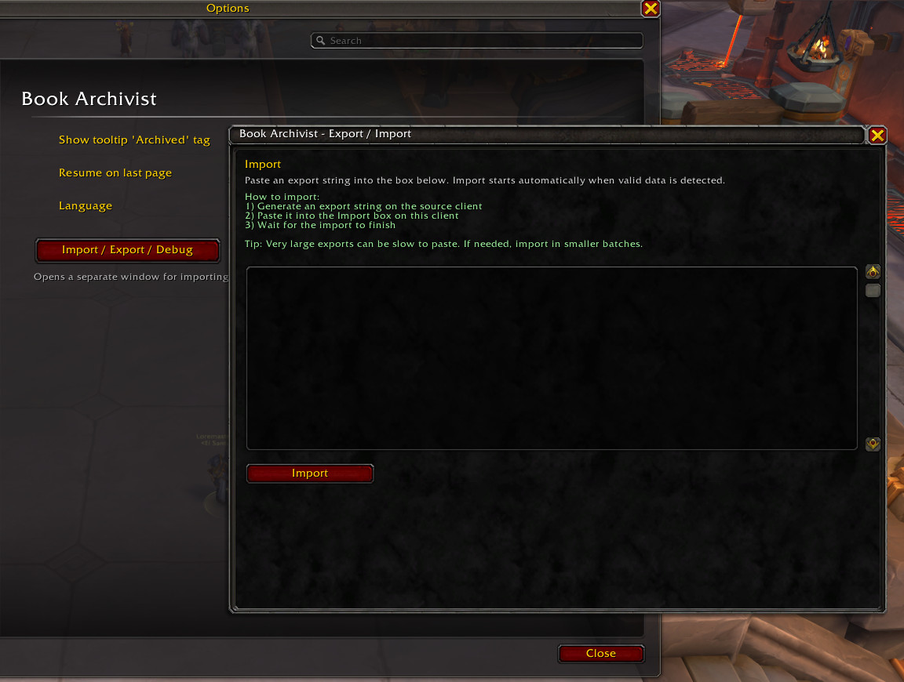
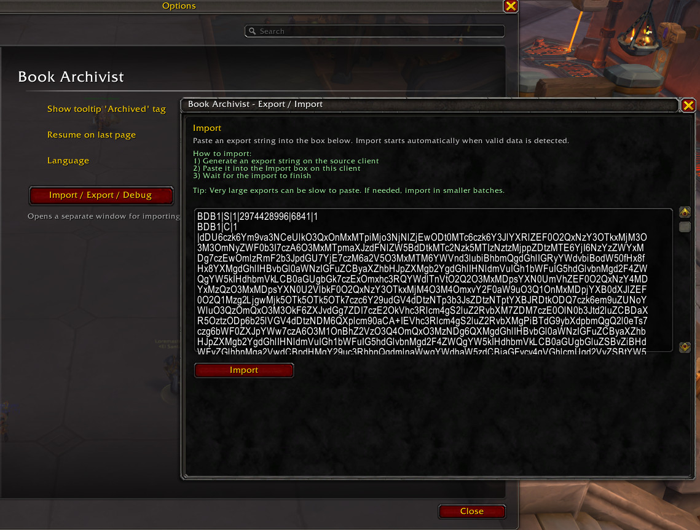
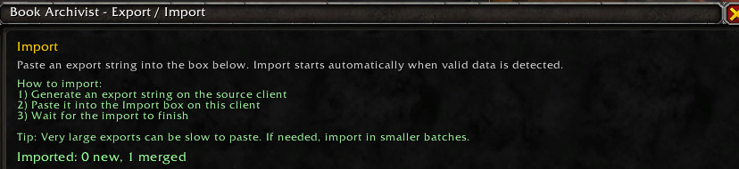

Easily import books shared by other players or restore from backups.

### Options & Settings
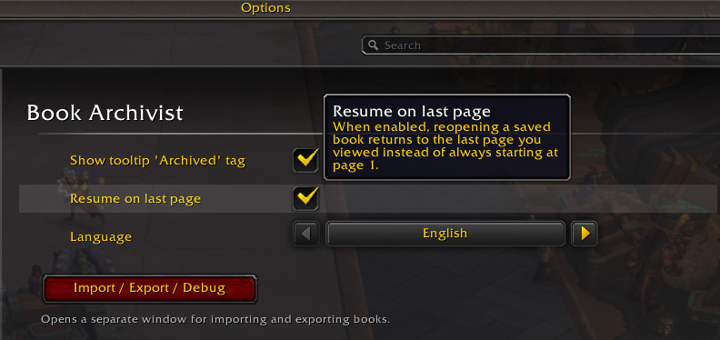
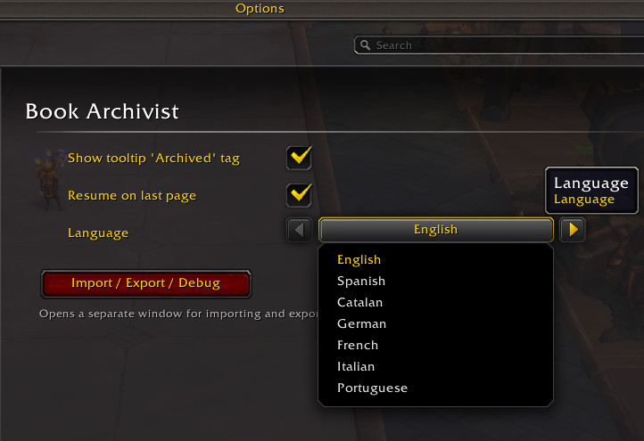
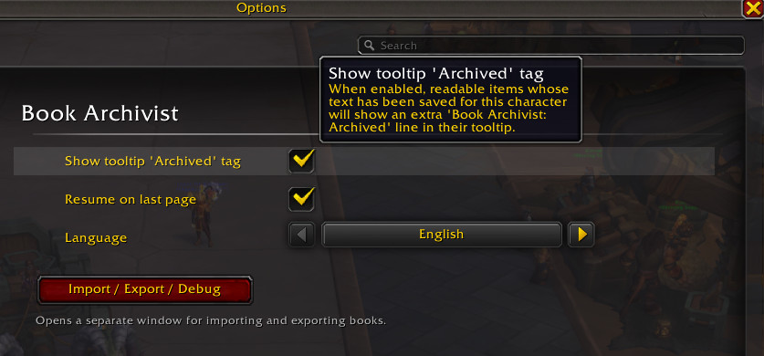

Customize your experience with multiple language support, tooltip integration, and reading preferences.

## Installation

1. Download or clone this repository.
2. Ensure the folder structure looks like:
   - `World of Warcraft/_retail_/Interface/AddOns/BookArchivist/BookArchivist.toc`
   - `World of Warcraft/_retail_/Interface/AddOns/BookArchivist/core/...`
   - `World of Warcraft/_retail_/Interface/AddOns/BookArchivist/ui/...`
3. Restart WoW or reload your UI (`/reload`).
4. Enable **BookArchivist** in the in-game AddOns list.

## Usage

- Open the library:
  - Click the BookArchivist minimap button, **or**
  - Use the configured slash command (e.g. `/ba`).
- The left list shows all saved books.
  - Use the search box to find titles or text.
  - Use the tabs to switch between **Books** and **Locations** views.
- Selecting a row updates the reader on the right.
  - Use the Prev/Next buttons or page selector to navigate pages.
  - Use the Share button to export a book for sharing with others.
  - If enabled, use the Delete button to remove an entry (with confirmation).
- Export and import books:
  - Click Share in the reader or Export in Options to generate an export string.
  - Copy it with Ctrl+C and share it, or paste it into another character's Import panel (Options → Import).
  - Import happens automatically when you paste valid data.

## Architecture overview

### Core

- `core/BookArchivist.lua` — addon bootstrap, event wiring, high-level helpers (e.g. `RefreshUI`, `ToggleUI`).
- `core/BookArchivist_Core.lua` — SavedVariables schema, keying, ordering, and persistence helpers.
- `core/BookArchivist_Capture.lua` — ItemText capture sessions and incremental persistence.
- `core/BookArchivist_Location.lua` — provenance (zone chain, NPC names) for location breadcrumbs.
- `core/BookArchivist_Minimap.lua` — minimap button state; persistence of angle/visibility.
- `core/BookArchivist_ImportWorker.lua` — staged import pipeline (decode/parse/merge/search/titles).
- `core/BookArchivist_Favorites.lua` — favorites system for bookmarking books.
- `core/BookArchivist_Recent.lua` — recent reads tracking.
- `core/BookArchivist_Locale.lua` — localization loader and helpers.

### UI framework

- `ui/BookArchivist_UI.lua` — shared UI state and `BookArchivist.UI.Internal` helpers (selection, list mode, widget registry).
- `ui/BookArchivist_UI_Core.lua` — binds list and reader modules to injected helpers; safe wrappers and logging.
- `ui/BookArchivist_UI_Frame_Layout.lua` — main frame body layout with fixed-width left panel (360px) and flexible right panel using native frames (`CreateFrame`, `InsetFrameTemplate3`).
- `ui/BookArchivist_UI_Frame_Chrome.lua` — frame chrome (dragging, portrait, title, options button, header blocks).
- `ui/BookArchivist_UI_Frame_Builder.lua` — creates the main frame using the layout/chrome helpers.
- `ui/BookArchivist_UI_Frame.lua` — entry point that ensures the frame is built and shown/hidden; orchestrates async frame building and OnShow refresh logic.
- `ui/BookArchivist_UI_Runtime.lua` — orchestration, slash commands (`/ba`, `/bookarchivist`), and safe refresh sequencing.

### List UI

- `ui/list/BookArchivist_UI_List.lua` — list controller and mode management.
- `ui/list/BookArchivist_UI_List_Layout.lua` — list header, search box, pagination, and scroll layout.
- `ui/list/BookArchivist_UI_List_Tabs.lua` — `Books/Locations` list tabs and their parent/rail setup.
- `ui/list/BookArchivist_UI_List_Filter.lua` — filter state and filter UI.
- `ui/list/BookArchivist_UI_List_Location.lua` — locations-mode list and tree behavior.
- `ui/list/BookArchivist_UI_List_Rows.lua` — row creation, pooling, and update logic.

### Reader UI

- `ui/reader/BookArchivist_UI_Reader.lua` — reader controller: selection, metadata lines, page navigation, render path selection.
- `ui/reader/BookArchivist_UI_Reader_HTML.lua` — shared HTML detection, stripping, and normalization helpers.
- `ui/reader/BookArchivist_UI_Reader_ArtifactAtlas.lua` — local artifact-book atlas used to crop Blizzard textures.
- `ui/reader/BookArchivist_UI_Reader_Rich_Parse.lua` — HTML-to-block parser used by the rich renderer.
- `ui/reader/BookArchivist_UI_Reader_Rich.lua` — rich renderer that turns blocks into FontStrings/Textures.
- `ui/reader/BookArchivist_UI_Reader_Delete.lua` — delete-button behavior and confirmation dialog.
- `ui/reader/BookArchivist_UI_Reader_Share.lua` — share popup and book export string generation.
- `ui/reader/BookArchivist_UI_Reader_Layout.lua` — reader header, navigation row, and scroll/text layout.

### Other UI

- `ui/minimap/BookArchivist_UI_Minimap.lua` — minimap button UI (click handling, toggling the main frame).
- `ui/options/BookArchivist_UI_Options.lua` — options panel, import UI, and integration with Blizzard's Settings.

## Development notes

- The codebase is modular: UI modules register themselves under `BookArchivist.UI.*` and often receive helpers via an injected context object.
- Frame creation should go through the existing safe-create wrappers (`Internal.safeCreateFrame` or equivalent) to avoid taint and ease testing.
- Layout uses shared metrics (`BookArchivist.UI.Metrics`) to keep padding and gaps consistent across list and reader.
- Rich HTML rendering is optional; when it fails or is disabled, the reader falls back to SimpleHTML or plain text.

For more detailed contributor guidance and conventions, see `.github/copilot-instructions.md`.

## Development Setup (Live Testing)

For rapid development, create a symbolic link from your WoW AddOns folder to your development directory. This allows WoW to read directly from your dev folder—no copying or building needed. Just edit, save, and `/reload` in-game.

**Windows (PowerShell):**
```powershell
# Directory junction (no admin required)
cmd /c mklink /J "C:\World of Warcraft\_retail_\Interface\AddOns\BookArchivist" "C:\dev\BookArchivist"

# OR symbolic link (requires admin)
New-Item -ItemType SymbolicLink -Path "C:\World of Warcraft\_retail_\Interface\AddOns\BookArchivist" -Target "C:\dev\BookArchivist"
```

**Linux / macOS:**
```bash
# Symbolic link
ln -s ~/dev/BookArchivist ~/Games/World\ of\ Warcraft/_retail_/Interface/AddOns/BookArchivist

# Example paths:
# Linux:  ~/Games/World\ of\ Warcraft/_retail_/Interface/AddOns/
# macOS:  /Applications/World\ of\ Warcraft/_retail_/Interface/AddOns/
```

**Verify it worked:**
- Windows: `dir "C:\World of Warcraft\_retail_\Interface\AddOns\BookArchivist"` (should show `<JUNCTION>` or `<SYMLINK>`)
- Linux/macOS: `ls -la ~/Games/World\ of\ Warcraft/_retail_/Interface/AddOns/BookArchivist` (should show `->` arrow)
